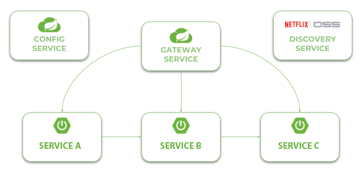

# Microservices with Spring Cloud Deepsignal Project 
In this project we are use [Spring Cloud Project](https://spring.io/projects/spring-cloud) for building microservice-based architecture.

## Getting Started 
Here's a full list of available in this project:
1. Using Spring Cloud Netlix **Eureka** as a discovery server, **Zuul** as a gateway, **OpenFeign** for communication and Spring Cloud Config Server. The example is available in the branch [master](https://git.saltlux.vn/Deepsignal/deepsignal-microservices). A detailed guide may be find in the following article: [Quick Guide to Microservices with Spring Boot 2.0, Eureka and Spring Cloud](https://piotrminkowski.com/2018/04/26/quick-guide-to-microservices-with-spring-boot-2-0-eureka-and-spring-cloud/)

### Usage

In the most cases you need to have Maven and JDK8+. The best way to run the sample applications is with IDEs like IntelliJ IDEA or Eclipse.  

## Architecture

Our project microservices-based system consists of the following modules:
- **gateway-service** - a module that Spring Cloud Netflix Zuul for running Spring Boot application that acts as a proxy/gateway in our architecture.
- **config-service** - a module that uses Spring Cloud Config Server for running configuration server in the `native` mode. The configuration files are placed on the classpath.
- **discovery-service** - a module that it uses Spring Cloud Netflix Eureka as an embedded discovery server.
- **deepsignal-adapter** - an intermediate module communicates with the lower layer and gets data to provide for the deepsignal web
- **deepsignal-web** - the web application interacts with the users.

The following picture illustrates the architecture described above.

